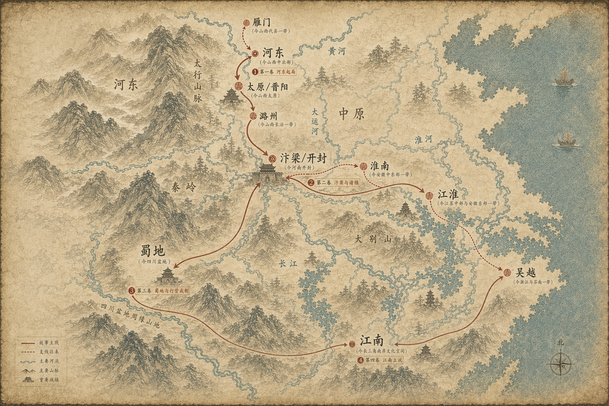

# 乱世里的设计模式

这是一套用历史小说笔法讲解 Java 设计模式的系列文章。

主角名叫沈策，出身寒门，少时读兵书，长于簿牍，后在五代十国的乱世中辗转于河东、汴梁、江淮、蜀地与南唐诸国之间。他最初只是军府小吏，后来做过幕僚、转运判官、行营参谋，也替几位节度使收拾过烂摊子。每到一地，他遇见的都不是单纯的历史难题，而是另一种“系统设计问题”。

这一套文章不把设计模式当成死记硬背的术语，而是尽量保留历史叙事的骨架：

- 先交代局势、人物和冲突
- 再指出故事里的治理难题
- 接着给出“如果不做抽象，代码通常会怎么写”的问题代码
- 再说明如何从问题代码一步步抽到模式
- 最后落回带注释的 Java 示例与工程判断

你可以把它当教程读，也可以把它当一部讲“乱世治理术”的小长篇来看。

配套阅读资料：

- [人物与势力设定](./SERIES-BIBLE.md)
- [地理附录：古今地名与行旅路线](./GEO-ATLAS.md)

## 适合谁读

- 会 Java 基础语法，但总觉得设计模式“知道名字，不会下手”的读者
- 想通过场景理解模式，而不是背定义的读者
- 想把技术文章写得更有叙事感的人

## 阅读方式

每一回都尽量独立，但整套内容有连续时间线。前十二回更偏“立规矩、建军府、理对象”，后十一回会走向更复杂的“结盟、传讯、分权、存档、诠释天下局势”。

如果你想按小说来读，建议先看 `SERIES-BIBLE.md` 里的主角、时代线和主要势力，再顺着 1 到 23 回往下看。若你想按教程来用，则可以只挑对应模式单篇阅读。

## 目录

1. [第一回：河东夜议，战法纷陈：策略模式](./articles/01-strategy.md)
2. [第二回：三镇募兵，各造其军：工厂方法模式](./articles/02-factory-method.md)
3. [第三回：玉玺只可一握：单例模式](./articles/03-singleton.md)
4. [第四回：边城起于图卷：建造者模式](./articles/04-builder.md)
5. [第五回：番邦使者，不通汉令：适配器模式](./articles/05-adapter.md)
6. [第六回：牙门深处，不见其人：代理模式](./articles/06-proxy.md)
7. [第七回：烽火连营，一呼百应：观察者模式](./articles/07-observer.md)
8. [第八回：军令成卷，可发可收：命令模式](./articles/08-command.md)
9. [第九回：祖制不改，变通在营：模板方法模式](./articles/09-template-method.md)
10. [第十回：城门开闭，各有时辰：状态模式](./articles/10-state.md)
11. [第十一回：奏章入京，层层有司：责任链模式](./articles/11-chain-of-responsibility.md)
12. [第十二回：战袍加身，甲上添甲：装饰器模式](./articles/12-decorator.md)
13. [第十三回：六曹分署，同出一府：抽象工厂模式](./articles/13-abstract-factory.md)
14. [第十四回：旧印翻刻，再造新符：原型模式](./articles/14-prototype.md)
15. [第十五回：中书门下，只露一门：外观模式](./articles/15-facade.md)
16. [第十六回：舟车虽异，共承其职：桥接模式](./articles/16-bridge.md)
17. [第十七回：大营之内，部伍成林：组合模式](./articles/17-composite.md)
18. [第十八回：边关小卒，名册共用：享元模式](./articles/18-flyweight.md)
19. [第十九回：案卷千箱，次第检看：迭代器模式](./articles/19-iterator.md)
20. [第二十回：群臣争语，须有居中者：中介者模式](./articles/20-mediator.md)
21. [第二十一回：败局可记，不可重蹈：备忘录模式](./articles/21-memento.md)
22. [第二十二回：巡按四方，各察其制：访问者模式](./articles/22-visitor.md)
23. [第二十三回：天下纷乱，终须立说：解释器模式](./articles/23-interpreter.md)

## 这一套反复要讲清的事

- 模式究竟解决什么工程痛点
- 如果不做抽象，代码会乱在哪里
- 从问题代码走到模式代码，中间到底经历了什么抽象动作
- Java 里最小可用的写法是什么
- 如果读者来自 JavaScript、Python、Go，这篇模式在 Java 里为什么会写成接口、类和对象
- 什么时候该用，什么时候只是徒增官样文章

## 建议阅读顺序

第一次读，可以先读：

1. `策略模式`、`工厂方法模式`、`建造者模式`
2. `适配器模式`、`代理模式`、`装饰器模式`
3. `观察者模式`、`命令模式`、`责任链模式`
4. `抽象工厂模式`、`桥接模式`、`组合模式`
5. `备忘录模式`、`访问者模式`、`解释器模式`
