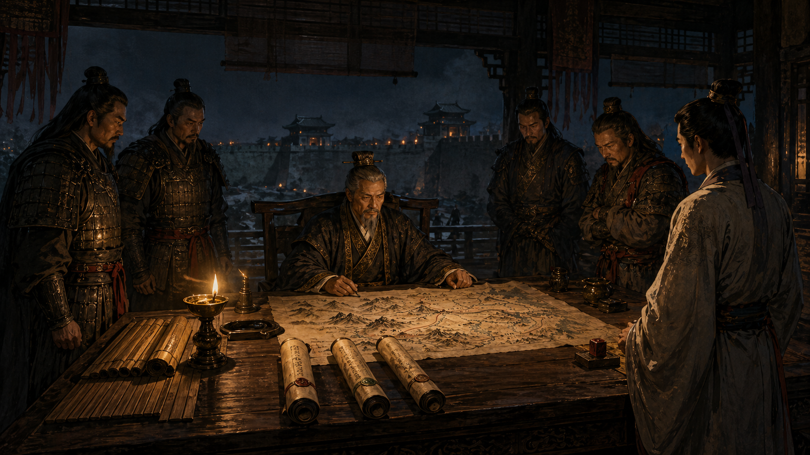

# 第一回：河东夜议，战法纷陈：策略模式



## 开篇引句

兵法之乱，不在敌强，而在将令无定。

## 楔子

后唐将倾，河东节度使府夜夜点灯。城外探马来报，说契丹游骑南下，潞州守军又请援，粮道上还见了不知归属的流兵。军府里人人都在说话，只有新来的小吏沈策站在末席，不敢抬头。

老节度使把案上的木简一推，忽然问他：“若敌军今夜来，怎么办？”

沈策答：“轻骑尚在，当先袭其粮车。”

节度使又问：“若我军疲敝，守军难出呢？”

沈策答：“那便闭城，守到对方先乱。”

“若对面主帅新立，诸将不和？”

“可使间者离之，不必硬拼。”

堂中将校听完，都说这年轻人见识不差。节度使却摇头：“你说了三种打法，却还没说出最要紧的一句。行军最怕的，不是没有办法，而是把所有办法都写死在一个人脑子里。今天战法添一条，明日又改一条，最后令文像乱麻，谁也接不住。”

沈策回去后，连夜改军议，把每一种战法独立成卷。主帅临阵不再自己拼凑招式，只需看局势，择一而用。

河东军府由此少了一半争吵，多了一分章法。

## 史局拆解

故事里真正的问题，不是“有没有好战法”，而是“同一类问题存在多种解法，而且这些解法会不断变化”。

一旦把这些变化都塞进一个统帅类里，代码往往会变成这样：

- 一个方法里塞满 `if...else`
- 每加一种情况就改一次核心逻辑
- 改一个分支时，很容易误伤其他分支

这类场景在业务中非常常见，比如：

- 会员折扣按等级计算
- 支付流程按渠道切换
- 路由算法按交通方式切换

## 模式之义

策略模式的意思很直白：把“会变化的算法”单独封装起来，让调度者只负责选择，不负责亲自实现全部细节。

在河东军府里，主帅负责决断；在代码里，上下文类负责持有策略并调用它。

说到底，主帅不必事事亲为，但必须知道何时该换哪一套战法。

## 如果不这样写，代码通常会长成什么样

很多人一开始会把所有战法都塞进同一个方法里：

```java
class Commander {
    public void issueOrder(String situation) {
        if ("raid".equals(situation)) {
            System.out.println("精骑夜出，焚其粮车");
        } else if ("defense".equals(situation)) {
            System.out.println("闭城固守，拒敌于门");
        } else if ("divide".equals(situation)) {
            System.out.println("散金纵谍，离其君臣");
        }
    }
}
```

这种写法的问题是：

- 所有战法都挤在一个类里
- 每增加一种打法，都要修改核心类
- 以后每种打法一复杂，这个类就会迅速膨胀

## 从问题代码到模式代码，应该怎么想

这里真正会变化的，是“采用哪种战法”；不会变化的，是“主帅负责下令”。

所以抽象动作其实很清楚：

1. 把不同战法拆成独立类
2. 让主帅只负责持有和切换战法

## Java 示例

```java
interface BattleStrategy {
    // 所有战法都通过同一个入口执行
    String execute();
}

class RaidStrategy implements BattleStrategy {
    @Override
    public String execute() {
        // 奔袭战法
        return "精骑夜出，焚其粮车";
    }
}

class DefenseStrategy implements BattleStrategy {
    @Override
    public String execute() {
        // 固守战法
        return "闭城固守，拒敌于门";
    }
}

class DivideStrategy implements BattleStrategy {
    @Override
    public String execute() {
        // 离间战法
        return "散金纵谍，离其君臣";
    }
}

class Commander {
    // 主帅只关心当前选中的战法
    private BattleStrategy strategy;

    public Commander(BattleStrategy strategy) {
        this.strategy = strategy;
    }

    public void changeStrategy(BattleStrategy strategy) {
        // 局势变化时，可以临时更换战法
        this.strategy = strategy;
    }

    public void issueOrder() {
        // 真正执行时，交给具体策略处理
        System.out.println(strategy.execute());
    }
}

public class Client {
    public static void main(String[] args) {
        // 先采用奔袭
        Commander commander = new Commander(new RaidStrategy());
        commander.issueOrder();

        // 后续再切换为固守
        commander.changeStrategy(new DefenseStrategy());
        commander.issueOrder();
    }
}
```

## 给其他语言背景的读者

如果你先接触的是 JavaScript 或 Python，可以把策略模式先理解成“把一组可替换的函数单独拿出来，再在运行时选一个执行”。  
Java 之所以常写成接口和类，不是因为模式本身要求“必须很多类”，而是因为 Java 更习惯把行为装进对象里。  
如果策略很轻，在 Java 里也可以用函数式接口和 Lambda 来写；接口、实现类这些外形，更多是 Java 的落地方式，不是模式的本体。

## 何时用

- 一件事有多种处理算法
- 算法会扩展，且彼此可以独立演进
- 你已经在一个类里闻到了浓重的条件分支味道

## 何时慎用

如果分支极少，而且未来几乎不会变化，直接写 `if...else` 往往更利落。模式是治乱的，不是给太平年月徒增礼数的。

## 类图速写

可画成“主帅选将图”：

- `Commander` 持有 `BattleStrategy`
- `RaidStrategy`、`DefenseStrategy`、`DivideStrategy` 并列挂在策略接口之下

## 下回伏笔

河东夜议后，沈策被派往三镇核查募兵。等他再回汴梁时，才发现战法只是第一层麻烦，真正难管的，是“同样叫招兵，造出来的却根本不是同一种军队”。

## 收束

策略模式的本质，是把“怎么打”从“谁来下令”里拆出去。变化归变化，调度归调度，军议才不会写成一锅粥。
