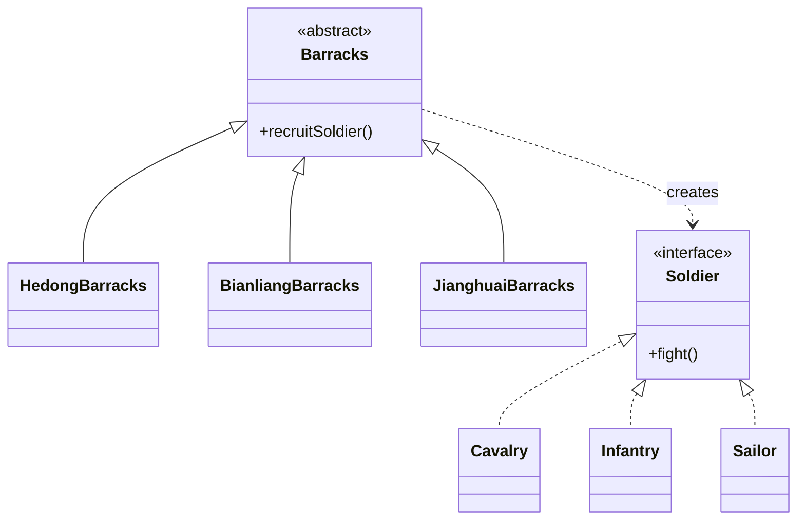

# 第二回：三镇募兵，各造其军：工厂方法模式


## 开篇引句

朝廷可以一纸诏令募兵，却不能一支笔写尽天下兵种。

## 楔子

河东军府稳住后，朝廷又催各地整兵。沈策被派去查募兵册，走了汴梁、河东、江淮三镇，回来时满身尘土，只说了一句：“兵部的文书，坏事了。”

原来朝中图省事，想把募兵流程一体化，于是发下统一成式。可河东需要骑兵，汴梁擅步军，江淮重水军，一份文书走天下，最后河东招来不会骑马的壮丁，江淮招来见水色变的山民。

兵部尚书拍案道：“入口一样，为何结果乱成这样？”

沈策答：“因为你只看见了募兵这件事相同，却没看见各镇真正造出来的军伍不同。流程可以统一，造什么兵，却不能由中枢一支笔全写死。”

于是他建议：朝廷只规定募兵的抽象入口，各镇军营自己决定产出什么兵种。

## 史局拆解

沈策翻三镇名册时，最刺眼的不是兵种不同，而是每一处差异都被写回兵部总册。河东添骑具，汴梁改甲号，江淮添船籍，中枢那份“统一募兵法”被改得像补丁摞补丁。

在代码里，常见的错误是业务层直接 `new` 具体类：

```java
new Cavalry();
new Infantry();
```

短期看很直接，长期看会让调用方和具体实现绑死。等到产品类型越来越多，业务代码里会遍地开花地出现具体类名。

## 模式之义

工厂方法模式的关键，是把“创建哪个具体对象”的决定交给子类，而不是由调用方写死。

朝廷只规定“募兵”这件事；河东军营负责造骑兵，汴梁军营负责造步卒。入口统一，产物可变。

## 如果不这样写，代码通常会长成什么样

最常见的写法，是业务层直接决定要创建哪个兵种：

```java
class MilitaryOffice {
    public Soldier recruit(String area) {
        if ("hedong".equals(area)) {
            return new Cavalry();
        } else if ("bianliang".equals(area)) {
            return new Infantry();
        }
        throw new IllegalArgumentException("unknown area");
    }
}
```

这段代码能工作，但问题很明显：

- 调用方直接依赖具体类
- 每加一个地区，都要去改原来的判断
- “如何创建”与“如何使用”混在一起

## 从问题代码到模式代码，应该怎么想

这里真正会变化的是“不同军营造出不同兵种”，而不是“募兵”这个动作本身。

所以可以这样拆：

1. 先抽出统一产品接口 `Soldier`
2. 再抽出统一创建入口 `Barracks`
3. 最后把“造什么兵”交给各地军营子类

## Java 示例

```java
interface Soldier {
    // 所有兵种都必须能作战
    void fight();
}

class Cavalry implements Soldier {
    @Override
    public void fight() {
        // 河东军营造出的骑兵
        System.out.println("骑兵冲锋");
    }
}

class Infantry implements Soldier {
    @Override
    public void fight() {
        // 汴梁军营造出的步卒
        System.out.println("步卒列阵");
    }
}

class Sailor implements Soldier {
    @Override
    public void fight() {
        // 江淮军营造出的水军
        System.out.println("水军登船");
    }
}

abstract class Barracks {
    // 统一的募兵入口，但不写死具体产品
    public abstract Soldier recruitSoldier();
}

class HedongBarracks extends Barracks {
    @Override
    public Soldier recruitSoldier() {
        // 河东军营自己决定造骑兵
        return new Cavalry();
    }
}

class BianliangBarracks extends Barracks {
    @Override
    public Soldier recruitSoldier() {
        // 汴梁军营自己决定造步卒
        return new Infantry();
    }
}

class JianghuaiBarracks extends Barracks {
    @Override
    public Soldier recruitSoldier() {
        // 新增地区时，新增军营子类即可
        return new Sailor();
    }
}

public class Client {
    public static void main(String[] args) {
        // 调用方只依赖抽象军营
        Barracks barracks = new JianghuaiBarracks();
        Soldier soldier = barracks.recruitSoldier();
        soldier.fight();
    }
}
```

## 给其他语言背景的读者

如果你来自 JavaScript 或 Python，可以把工厂方法先理解成“把创建逻辑单独包起来”，而不是业务代码里到处直接构造对象。  
Java 里常用抽象类和子类承载这个变化点，因为它天然适合把“统一入口”和“具体产物”分开。  
模式真正关心的是“谁负责创建”，不是“是否一定要继承”。

Objective-C 和 Swift 里，很多时候会用类方法、静态工厂方法、protocol + 具体类型，或直接用闭包注入创建逻辑。Swift 的枚举和泛型也会削弱一部分工厂类需求：如果产品族很小、类型关系清楚，`switch` 或泛型初始化器可能更自然。

Rust 里通常不把它写成传统 OO 的“工厂父类 + 工厂子类”。更常见的是关联函数、trait 的关联类型、泛型工厂函数，或者在需要运行时分派时返回 `Box<dyn Trait>`。也就是说，创建权仍要隔离，但隔离方式会顺着所有权和 trait 系统来。

## 何时用

- 同一类产品有多种具体实现
- 创建逻辑会随场景扩展
- 你不想在业务代码里散落太多 `new ConcreteClass()`

## 何时慎用

如果产品种类稳定、创建动作极轻，硬拆出一堆工厂类，很容易像为一扇角门配了三道禁军。

## 类图速写

可画成“三镇募兵图”：

- 抽象层是 `Barracks`
- 具体军营是 `HedongBarracks`、`BianliangBarracks`
- 产物统一抽象为 `Soldier`



## 下回伏笔

三镇募兵之乱平息后，沈策被留在汴梁清点印信。那时他第一次知道，系统里最难管的东西，有时不是太多，而是本不该有第二个。

## 收束

工厂方法模式讲的不是“怎么招兵”，而是“谁有权决定招出什么兵”。这层权力下放清楚了，系统扩展时才不会处处碰壁。
