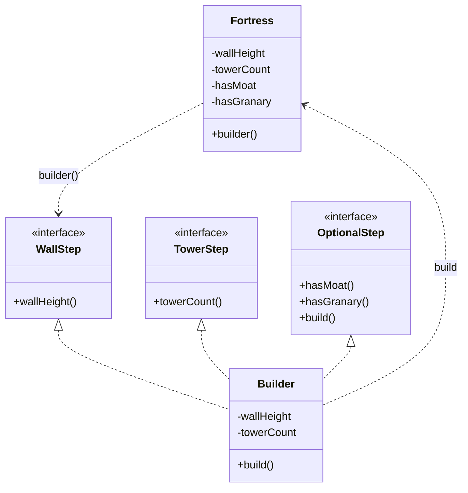

# 第四回：边城起于图卷：建造者模式


## 开篇引句

一座城若能被一句话造完，多半也会被一句话攻破。

## 楔子

北境秋寒，边报又急。朝廷命河东修一座新城，要求“可守三月，可屯万人，可纳粮，可驻骑兵”。诏书只有短短十几字，可工部一到现场就发现，真正的难处全在没写出来的地方。

城墙多高，箭楼几座，瓮城要不要，粮仓放内城还是外郭，水源引河还是凿井，敌军若以火攻，城门结构还得另改。一个年轻工匠提议，把所有配置都塞进构造方法，老师傅听完冷笑：“你这是想用一行竹简写完一座城。”

沈策翻着图卷，看了半天，只说：“筑城不能一锤子砸出来，得按步骤来。”

## 史局拆解

当夜，工部把第一版城图送到沈策案前。竹简上密密麻麻写着：墙高十二丈，箭楼四座，护城河开，粮仓入内城。可旁边的小吏一换手，就把“护城河”和“粮仓”两个布置读反了。

沈策没有责怪他，只把竹简推回去：“不是人记性差，是这道令本身不该这样写。”

对象字段多、可选参数多、构建顺序复杂时，直接写一个“大而全”的构造方法，会让调用者根本看不出自己到底造了个什么东西。参数越多，越像把一座城压成一串没有标注的数字和布尔值。

这就是经典的构造参数地狱。

## 模式之义

沈策让匠人重画图卷：先定城墙，再定箭楼，再定护城河，粮仓最后落位。每一步都写在自己的格子里，等所有格子都验过，才盖上工部印。

建造者模式做的也是这件事：把复杂对象的创建过程拆成多个清晰步骤，最后由 `build()` 收口。

图卷一页一页画，城池一层一层起。调用者不再被迫一次性背出所有参数。

## 如果不这样写，代码通常会长成什么样

最容易写成一个很长的构造方法：

```java
class Fortress {
    public Fortress(int wallHeight, int towerCount, boolean hasMoat, boolean hasGranary) {
    }
}

public class Client {
    public static void main(String[] args) {
        Fortress fortress = new Fortress(12, 4, true, true);
    }
}
```

表面上构造成功了，但读代码的人很难一眼看出 `12, 4, true, true` 到底分别代表什么。

## 给其他语言背景的读者

如果你来自 JavaScript 或 Python，可能会觉得“传一个大配置对象进去不就行了”。这种感觉并没有错。  
建造者模式在 Java 里常见，是因为 Java 的构造器参数一多，读写体验会迅速变差，尤其在字段很多、可选项很多时更明显。  
模式本身关心的是“把复杂创建过程拆开”，至于在别的语言里用链式 builder、配置对象还是工厂函数，都是落地方式的差异。

如果你来自 Objective-C 或 Swift，这个问题还要再拆一层看。它们的调用本来就带参数名：

```swift
let fortress = Fortress(
    wallHeight: 12,
    towerCount: 4,
    hasMoat: true,
    hasGranary: true
)
```

这时“参数语义丢失”已经被语言本身缓解了，所以不必为了四五个字段硬套一个 Builder。Swift 里更自然的写法，常常是带默认值的初始化方法、配置结构体，或在需要声明式组装时使用 result builder。

但 Builder 并没有因此消失。若造城不是“填几个参数”，而是“先定地基，再定城墙，再校验粮仓和水源是否互相冲突，最后才能封图”，也就是创建过程有顺序、校验、不变量或多种可选部件，那么即使在 Swift / Objective-C 里，类似 Builder 的分步 API 仍然有价值。

Rust 里没有传统命名参数，结构体字面量和 `Default` 能解决一部分语义问题：

```rust
let fortress = Fortress {
    wall_height: 12,
    tower_count: 4,
    has_moat: true,
    has_granary: true,
};
```

如果字段多、默认值多，Rust 也常用 builder，很多库还会用派生宏生成 builder。它的重点同样不是追求形式，而是在所有权、必填字段、校验步骤之间给出一个清楚的构建过程。

## 从问题代码到模式代码，应该怎么想

回到沈策案前，真正复杂的不是“城”这个结果，而是从荒地到城池的那套过程。

代码里也一样。这里真正复杂的，不是对象本身，而是“创建过程”。

所以可以这样拆：

1. 先准备一个 `Builder`
2. 按步骤设置各项配置
3. 最后调用 `build()` 生成完整对象

## Java 示例

```java
class Fortress {
    private final int wallHeight;
    private final int towerCount;
    private final boolean hasMoat;
    private final boolean hasGranary;

    private Fortress(Builder builder) {
        // 最终对象从 Builder 中取出全部配置
        this.wallHeight = builder.wallHeight;
        this.towerCount = builder.towerCount;
        this.hasMoat = builder.hasMoat;
        this.hasGranary = builder.hasGranary;
    }

    public static WallStep builder() {
        return new Builder();
    }

    public interface WallStep {
        TowerStep wallHeight(int wallHeight);
    }

    public interface TowerStep {
        OptionalStep towerCount(int towerCount);
    }

    public interface OptionalStep {
        OptionalStep hasMoat(boolean hasMoat);
        OptionalStep hasGranary(boolean hasGranary);
        Fortress build();
    }

    private static class Builder implements WallStep, TowerStep, OptionalStep {
        private int wallHeight;
        private int towerCount;
        private boolean hasMoat;
        private boolean hasGranary;

        @Override
        public TowerStep wallHeight(int wallHeight) {
            // 第一步必须先定城墙高度
            this.wallHeight = wallHeight;
            return this;
        }

        @Override
        public OptionalStep towerCount(int towerCount) {
            // 第二步再定箭楼数量
            this.towerCount = towerCount;
            return this;
        }

        @Override
        public OptionalStep hasMoat(boolean hasMoat) {
            // 可选配置：是否修护城河
            this.hasMoat = hasMoat;
            return this;
        }

        @Override
        public OptionalStep hasGranary(boolean hasGranary) {
            // 可选配置：是否配置粮仓
            this.hasGranary = hasGranary;
            return this;
        }

        @Override
        public Fortress build() {
            if (wallHeight <= 0) {
                throw new IllegalStateException("城墙高度必须大于 0");
            }
            if (towerCount < 0) {
                throw new IllegalStateException("箭楼数量不能为负数");
            }
            if (hasGranary && wallHeight < 8) {
                throw new IllegalStateException("内城设粮仓时，城墙高度不能低于 8");
            }
            // 所有步骤完成后，再生成最终对象
            return new Fortress(this);
        }
    }
}

public class Client {
    public static void main(String[] args) {
        Fortress fortress = Fortress.builder()
            .wallHeight(12)
            .towerCount(4)
            .hasMoat(true)
            .hasGranary(true)
            .build();
    }
}
```

## 何时用

- 对象参数很多，且多数是可选项
- 创建步骤本身有顺序和校验要求
- 希望对象创建完后尽量保持不可变

## 何时慎用

如果对象很简单，两个字段就能说清，建造者模式反而像修一间草屋却先立了都城图籍司。

## 类图速写

可画成“图卷筑城图”：

- `Fortress.Builder` 分步收集参数
- `build()` 最终生成 `Fortress`



## 下回伏笔

边城图成后，吴越使者恰入汴梁。沈策本以为工部已经够难缠，没想到真正让朝廷发愁的，是两套制度之间连话都说不通。

## 收束

建造者模式承认了一件事：复杂对象本就不该“一把铸成”，而应当“按图分步而成”。
