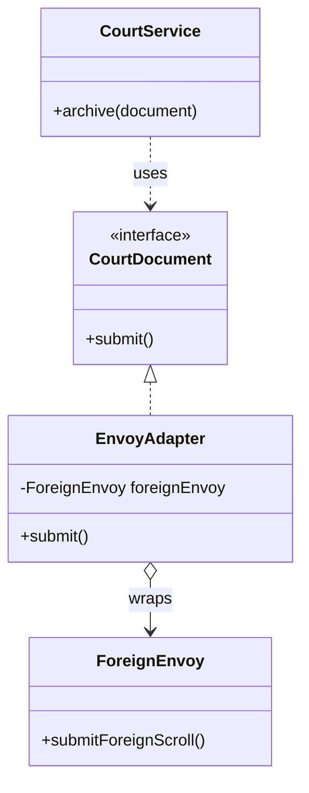

# 第五回：番邦使者，不通汉令：适配器模式


## 开篇引句

世上多的是能做事的人，少的是说得通两边话的人。

## 楔子

吴越来使入汴梁，贡单写法与中原全异，连度量单位都不相同。鸿胪寺的小官拿着文书直皱眉，嘴里念着“绢若干匹、香药若干匣”，可对面报上来的却是海贸旧制、番邦俗称。两边都不是故意刁难，只是各自按各自的规矩办事。

有人提议让吴越重写一遍。使者不肯，说一路数千里，到了京城又改规制，未免荒唐。也有人提议让朝廷所有衙门都学番文，众人听了更觉离谱。

沈策看了一眼，说：“何必让双方改祖宗制度？设一名通事官，专译此类文书便可。”

## 史局拆解

沈策没有让吴越使者重写贡单，也没有让六部从头学海商旧制。两边制度都已运行多年，真正缺的是中间那道可控的转译层。

在软件里，老系统、第三方接口、外部库常常都能提供你想要的能力，只是接口不兼容。你不能总指望别人为你改，也不该为了兼容它，重写自己现有的调用逻辑。

## 模式之义

适配器模式的做法很像鸿胪寺通事官：保留原系统不动，在外层包一层翻译，把它转换成当前系统能接受的接口。

## 如果不这样写，代码通常会长成什么样

最常见的问题，是业务代码直接碰到一个不兼容的旧接口：

```java
class ForeignEnvoy {
    public String submitForeignScroll() {
        return "番邦格式文书";
    }
}

class CourtService {
    public void handle() {
        ForeignEnvoy envoy = new ForeignEnvoy();
        System.out.println(envoy.submitForeignScroll());
    }
}
```

问题不在这段代码不能运行，而在于：朝廷系统真正想要的接口并不是这个。

## 从问题代码到模式代码，应该怎么想

这里不需要重写旧对象，而是需要在旧对象和新系统之间加一层“翻译”。

所以可以这样做：

1. 定义当前系统想要的目标接口
2. 写一个适配器包住旧对象
3. 在适配器里完成接口转换

## Java 示例

```java
class ForeignEnvoy {
    public String submitForeignScroll() {
        // 旧系统原本提供的方法
        return "番邦格式文书";
    }
}

interface CourtDocument {
    // 朝廷系统期望的统一接口
    String submit();
}

class EnvoyAdapter implements CourtDocument {
    private final ForeignEnvoy foreignEnvoy;

    public EnvoyAdapter(ForeignEnvoy foreignEnvoy) {
        // 适配器内部持有旧对象
        this.foreignEnvoy = foreignEnvoy;
    }

    @Override
    public String submit() {
        // 在这里把旧接口翻译成新接口
        return "转译后：" + foreignEnvoy.submitForeignScroll();
    }
}

class CourtService {
    public void archive(CourtDocument document) {
        // 新系统只认 CourtDocument，不关心旧对象来自哪里
        System.out.println("归档：" + document.submit());
    }
}

public class Client {
    public static void main(String[] args) {
        ForeignEnvoy oldEnvoy = new ForeignEnvoy();
        CourtDocument document = new EnvoyAdapter(oldEnvoy);

        new CourtService().archive(document);
    }
}
```

## 给其他语言背景的读者

如果你先接触的是 JavaScript，可以把适配器先理解成“包一层转换函数”，把旧接口转成当前系统想要的接口。  
Java 里常把它写成一个单独的适配器类，是因为接口类型在 Java 中比较重要，系统往往明确要求“你必须实现这个接口”。  
模式本身只是解决兼容问题，不要求一定长成类图里的样子。

Python 里适配器常常只是一个小函数或薄包装对象，因为鸭子类型让“长得像目标接口”已经足够。Objective-C 里可能落成 protocol 适配对象或 category；Swift 里则常用 extension、protocol conformance 或包装结构体，把旧 API 接到新协议上。

Rust 里适配器很常见，只是名字未必叫 Adapter。`From` / `Into`、newtype 包装、trait 实现都能把一种接口转成另一种接口。由于孤儿规则限制，你不能随便给外部类型实现外部 trait，这时 newtype 就像专门设的通事官。

## 何时用

- 接第三方系统
- 新旧系统迁移
- 旧代码暂时无法重构，但必须接入新流程

## 何时慎用

如果接口不兼容的根源其实是你自己内部设计混乱，适配器只能暂时挡风，不能代替真正重构。通事官再能干，也不能永远替六部收拾烂账。

## 类图速写

可画成“通事官转译图”：

- `EnvoyAdapter` 对外实现 `CourtDocument`
- 内部组合 `ForeignEnvoy`



## 下回伏笔

通译番文之后，沈策被派去淮南借粮。到了那座藩镇牙门前，他才见识到另外一种秩序: 有些人并不是你想见就能直接见到的。

## 收束

适配器模式不是改造天下，而是在两个体系之间放一个懂双方规矩的人。
