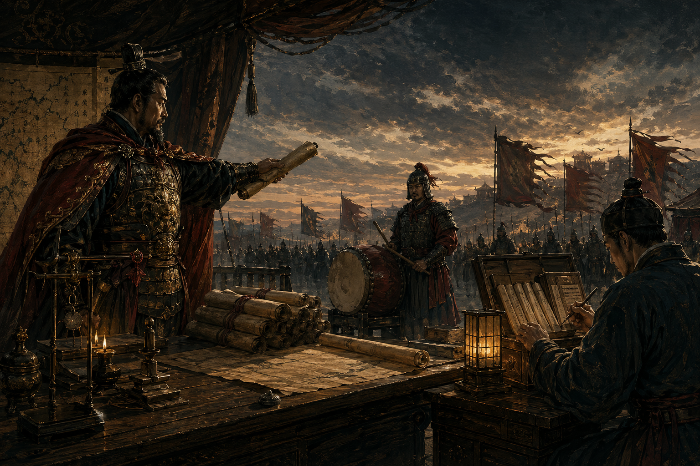

# 第八回：军令成卷，可发可收：命令模式



## 开篇引句

口耳相传的军令，最像风，来时响，过后无凭。

## 楔子

一次大战前，河东军中出了差错。前营听见擂鼓便进，后营却说接到的是固守原地的口令，险些在夜里自相践踏。事后查问，才发现问题不在士卒，而在军令口口相传，既不能核验，也无法追溯。

沈策于是重整行营文书，把各种军令都写成固定格式：谁发的、何时发的、交给谁、执行什么、能否撤回。将领们起初嫌麻烦，可打过两次仗后，再没人说此举多余。

因为成卷之后，军令不再只是某个人喊出口的一句话。它可以被登记、移交、复核，也能在误判时追回。沈策要的不是文书好看，而是让一次请求在系统里留下独立身份。

## 史局拆解

如果请求只是一个立即执行的方法调用，发送者和执行者就绑得很死。一旦你想做记录、排队、撤销、重试，请求本身就需要变成一等对象。

直接调用最大的问题，是请求还没来得及成为“东西”，就已经消失在调用栈里了。日志只能硬插，重试只能包在外层，撤销更是无从谈起。

## 模式之义

命令模式的核心，是把“请求”封装成对象。这样一来，发令者、执行者、记录者就能分开治理。

## 如果不这样写，代码通常会长成什么样

最直接的写法，是发令者直接去调用执行者：

```java
class General {
    public void issue(DrumCorps drumCorps) {
        drumCorps.attack();
    }
}
```

这样虽然短，但如果以后要记录、排队或撤销，请求本身根本无处安放。

## 从问题代码到模式代码，应该怎么想

这里真正要独立出来的，不是执行者，而是“命令”本身。

所以可以这样拆：

1. 先把请求封装成 `Command`
2. 发令者只持有命令
3. 具体命令内部再去调用真正执行者

这一步的关键，是把“发令”与“执令”之间的那一瞬间保存下来。命令对象像一份军令文书，既知道要做什么，也知道交给谁做。

## Java 示例

```java
interface Command {
    // 所有命令都必须能被执行
    void execute();
}

class DrumCorps {
    public void attack() {
        // 真正干活的是鼓手营
        System.out.println("擂鼓进军");
    }
}

class AttackCommand implements Command {
    // 命令对象内部持有接收者
    private final DrumCorps drumCorps;

    public AttackCommand(DrumCorps drumCorps) {
        this.drumCorps = drumCorps;
    }

    @Override
    public void execute() {
        // 执行命令时，再调用接收者
        drumCorps.attack();
    }
}

class General {
    // 主帅只关心自己手里拿着哪份军令
    private Command command;

    public void setCommand(Command command) {
        this.command = command;
    }

    public void issue() {
        // 下令时统一执行命令对象
        command.execute();
    }
}
```

## 给其他语言背景的读者

如果你来自 JavaScript，可以把命令模式先理解成“把一个待执行动作连同上下文打包起来”。  
Java 里常写成 `Command` 接口和具体命令类，是因为它想把请求本身变成一个可保存、可排队、可替换的对象。  
模式本身关心的是请求独立化，不是为了把简单函数调用故意写重。

## 何时用

- 需要把请求排队或延迟执行
- 需要做日志、审计、撤销
- 发送者和执行者不应直接耦合

## 何时慎用

简单调用如果也一律封成命令对象，工程会平白生出大量样板代码。不是每一句口头命令都值得入卷归档。

## 类图速写

可画成“发令执令图”：

- `General` 持有 `Command`
- `AttackCommand` 组合 `DrumCorps`

## 下回伏笔

军令既已成卷，老将又把沈策召入帐中，给他看一套几十年不改的出征旧制。那时他才明白，不是所有规矩都该变化，有些流程恰恰因为不能变，才撑得起千军万马。

## 收束

命令模式让“要做什么”脱离“谁来做”，于是军令可以传、可以存、可以查，也可以在必要时收回重发。
