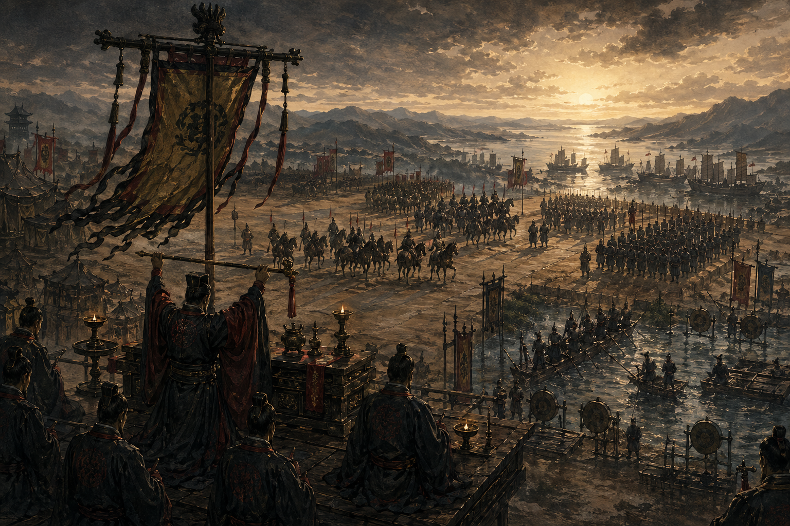
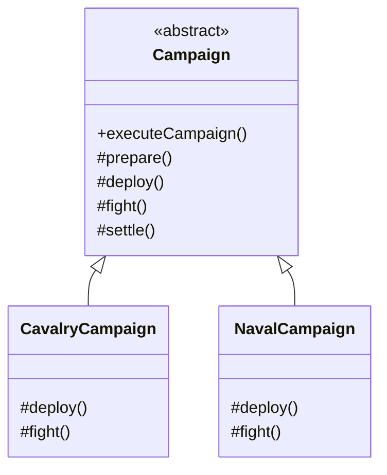

# 第九回：祖制不改，变通在营：模板方法模式



## 开篇引句

真正能传下去的规矩，不是处处一样，而是大体不乱。

## 楔子

沈策在一位宿将帐下做过半年行营参谋。那位将军治军极严，每逢大战，必先祭旗，再整队，再布阵，再交锋，最后清点军资与伤亡。谁若敢乱了次序，轻则军杖，重则夺职。

可同样一套流程，骑兵布阵和水军布阵显然不是一回事。沈策曾问将军：“既然各军打法不同，为何流程还定得这样死？”将军答：“因为规矩是骨架，变化是血肉。骨架若散，血肉越盛，死得越快。”

沈策在帐中看了几日，才明白这不是老将守旧。祭旗、整军、布阵、交锋、清点，每一步都牵动军心和后勤。可以让骑兵、水军各自发挥，却不能让他们把整套出征次序也各改一遍。

## 史局拆解

某些业务流程骨架稳定，但部分步骤需要因子类而变。如果每个子类都把整套流程重写一遍，重复代码会越来越多，秩序也难统一。

更隐蔽的风险是：复制出来的流程迟早会出现细小差异。今天少一次校验，明天改错一个顺序，最后业务上明明是一类流程，代码里却变成几套互不相认的制度。

## 模式之义

模板方法模式在父类中定义算法骨架，把可变步骤留给子类实现。

## 如果不这样写，代码通常会长成什么样

很多人会让每个子类自己重写整套流程：

```java
class CavalryCampaign {
    public void execute() {
        System.out.println("祭旗整军");
        System.out.println("骑兵两翼展开");
        System.out.println("高速穿插");
        System.out.println("清点战损");
    }
}
```

这样写的结果是：公共流程会被一遍遍复制。

## 从问题代码到模式代码，应该怎么想

这里稳定不变的是“大战流程骨架”，变化的是其中几个具体步骤。

所以可以这样拆：

1. 把固定流程放到父类
2. 把变化步骤留给子类

抽象动作不是把所有步骤都搬进父类，而是先分清“顺序不可乱”和“内容可替换”。父类守住顺序，子类只填变化点。

## Java 示例

```java
abstract class Campaign {
    // final 保证流程顺序不被子类改乱
    public final void executeCampaign() {
        prepare();
        deploy();
        fight();
        settle();
    }

    protected void prepare() {
        // 所有战役都共享的准备流程
        System.out.println("祭旗整军");
    }

    // 以下步骤交给子类决定
    protected abstract void deploy();

    protected abstract void fight();

    protected void settle() {
        // 收尾流程同样可以复用
        System.out.println("清点战损");
    }
}

class CavalryCampaign extends Campaign {
    @Override
    protected void deploy() {
        // 骑兵的布阵方式
        System.out.println("骑兵两翼展开");
    }

    @Override
    protected void fight() {
        // 骑兵的作战方式
        System.out.println("高速穿插");
    }
}

class NavalCampaign extends Campaign {
    @Override
    protected void deploy() {
        // 水军有自己的布阵方式
        System.out.println("战船列阵");
    }

    @Override
    protected void fight() {
        // 水军有自己的作战方式
        System.out.println("顺流夹击");
    }
}

public class Client {
    public static void main(String[] args) {
        Campaign cavalry = new CavalryCampaign();
        Campaign navy = new NavalCampaign();

        cavalry.executeCampaign();
        navy.executeCampaign();
    }
}
```

## 给其他语言背景的读者

如果你来自 JavaScript 或 Python，可以把模板方法先理解成“固定流程 + 若干可覆写钩子”。  
Java 里常借助继承来表达这件事，因为父类很适合承载不变骨架，子类负责填入变化步骤。  
模式本身关心的是骨架与变化点分离，不是继承本身。

Objective-C 里这类结构常出现在基类回调、delegate 或 framework life cycle 里；Swift 里则要谨慎使用继承，因为 protocol extension、闭包注入和组合往往更轻。若流程骨架来自框架，例如视图生命周期，模板方法很自然；若只是业务流程，Swift 里用函数组合可能更清楚。

Rust 不鼓励用继承表达骨架，因此传统模板方法会变形。你可以用 trait 提供默认方法，把必填步骤留给实现者；也可以把可变步骤作为函数或泛型参数传入。Rust 版的重点仍是“顺序由一处掌控，变化点被显式暴露”，只是不会长成父类和子类。

## 何时用

- 流程骨架固定
- 局部步骤需要子类自定义
- 希望统一执行顺序和公共逻辑

## 何时慎用

如果变化点太多，父类会被钉满钩子，最后祖制不像祖制，倒像一张补丁簿。

## 类图速写

可画成“祖制与营法图”：

- `Campaign` 提供固定流程
- 子类只改 `deploy()`、`fight()` 等变化步骤



## 下回伏笔

只是世上也有些局面，不是靠祖制就能写尽。等沈策到了边城，才发现同一个守城官，在不同局势下像是换了一个人。

## 收束

模板方法模式先定大礼，再留活口。规矩不乱，变化才有依附之处。
