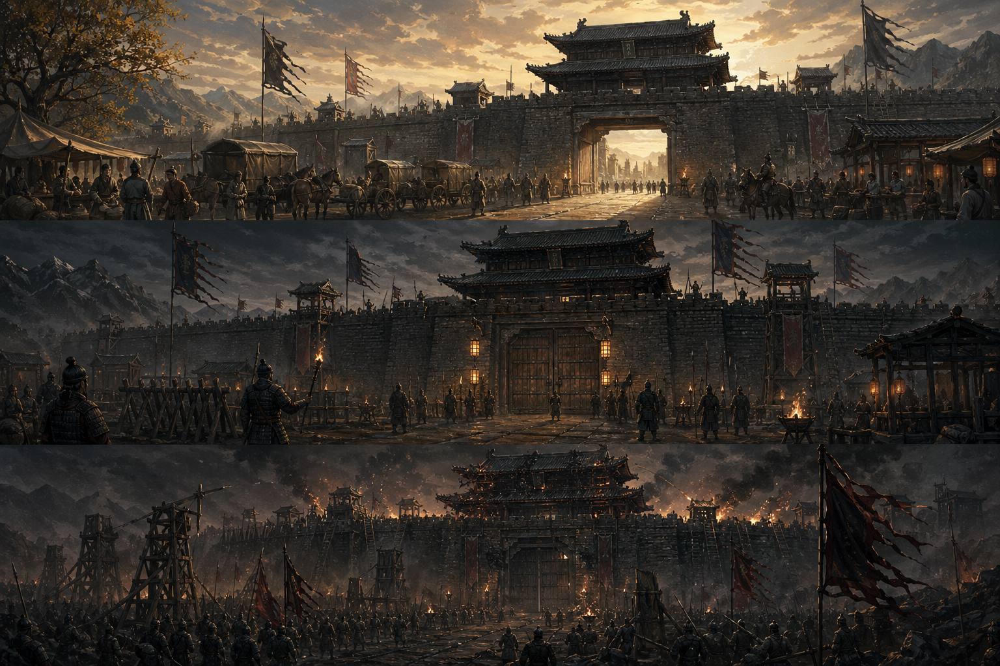

# 第十回：城门开闭，各有时辰：状态模式



## 开篇引句

城门不只是门，它是局势在木板上的影子。

## 楔子

沈策后来在边城住了两年，最先学会的一件事，就是别把城门当成一块木板。太平时，它是商路；戒严时，它是筛子；围城时，它是命；援军临近时，它又成了反击的缺口。

同一座城，局势一变，守将的行为就全变了。若还让一个守城官拿着厚厚一叠条件判断去决定该怎么办，迟早会在最要命的时候判错。

沈策见过一次误判：商队尚未清完，斥候已报敌骑逼近，城门吏还按太平章程慢慢验牒。那一刻他才知道，问题不在城门吏懒，而在旧章把所有局势都塞进同一套判断里。

## 史局拆解

对象在不同状态下表现出完全不同的行为时，常见坏味道就是方法里塞满大段 `switch`。状态越多，逻辑越乱。

这种乱不是单纯行数问题。状态之间往往还会互相制约：从太平到戒严可以，从围城到开市不行。若这些限制也都堆在一个方法里，新增状态时很容易漏掉某条转换边界。

## 模式之义

状态模式把每种状态对应的行为单独封装起来，让状态自己决定该如何响应。

## 如果不这样写，代码通常会长成什么样

最常见的写法，是把所有状态判断堆进一个方法：

```java
class City {
    public void manage(String state) {
        if ("peace".equals(state)) {
            System.out.println("正常通商，城门开放");
        } else if ("siege".equals(state)) {
            System.out.println("关闭城门，按战时配给");
        }
    }
}
```

状态一多，这段判断会越来越长。

## 从问题代码到模式代码，应该怎么想

这里变化的，不是“管理城池”这个动作，而是“城池在不同状态下的行为”。

所以可以这样拆：

1. 每种状态各自写成对象
2. 城池只记录当前状态
3. 管理动作直接交给当前状态处理

抽象之后，`City` 不再替每种局势背诵禁令。它只保存“现在处于什么状态”，具体该开门、闭门还是分粮，由状态对象自己回答。

## Java 示例

```java
interface CityState {
    // 每种状态都要能处理当前局势
    void handle();
}

class PeaceState implements CityState {
    @Override
    public void handle() {
        // 太平状态下的行为
        System.out.println("正常通商，城门开放");
    }
}

class SiegeState implements CityState {
    @Override
    public void handle() {
        // 围城状态下的行为
        System.out.println("关闭城门，按战时配给");
    }
}

class City {
    // 城池只持有当前状态
    private CityState state;

    public void setState(CityState state) {
        this.state = state;
    }

    public void manage() {
        // 真正怎么管理，由状态对象决定
        state.handle();
    }
}
```

## 给其他语言背景的读者

如果你来自 JavaScript，可以把状态模式先理解成“把不同状态下的行为表单独拆出去”，而不是在一个函数里堆条件分支。  
Java 里常写成多个状态类，是因为它适合把每种状态都变成可替换对象。  
模式本身关心的是状态驱动行为，不是为了让简单 if/else 看起来更学术。

## 何时用

- 对象行为强烈依赖内部状态
- 状态切换明确且可枚举
- 你正被大量条件判断拖住

## 何时慎用

如果状态极少，直接条件分支可能更清楚。别为了一扇日常小门的开关，先建一座完整城防司。

## 类图速写

可画成“城防换令图”：

- `City` 持有 `CityState`
- `PeaceState`、`SiegeState` 等状态并列管理行为

## 下回伏笔

边城守住后，沈策被召回京师入中书门下。那里没有战鼓，却有另一种绵密的威压: 一道奏章，要经过多少人的手，才算真正抵达能做决定的人。

## 收束

状态模式把“不同局势下的不同做法”交还给状态本身，于是对象不必再背着一整本城防禁令。
