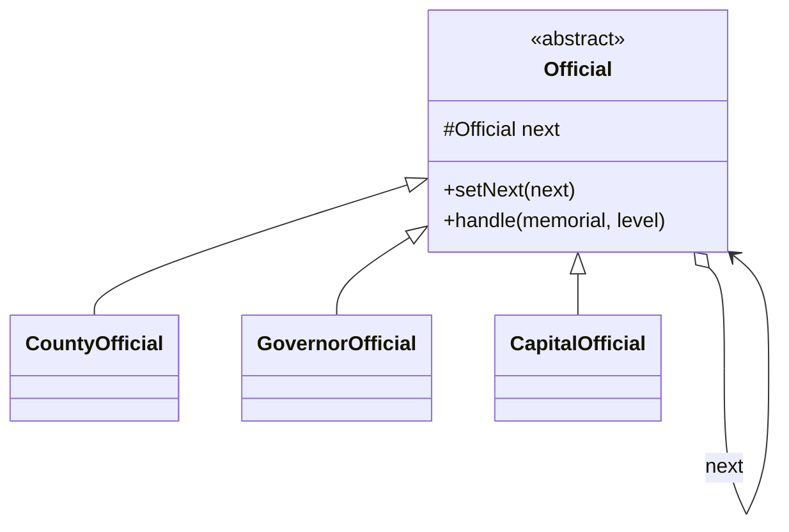

# 第十一回：奏章入京，层层有司：责任链模式


## 开篇引句

天下文书最怕的，不是走得慢，而是走到一半无人接手。

## 楔子

地方奏章入京，并不是一出州境就能直达天听。沈策在中书门下供职时，看过无数案卷：小案到州府即止，军务上行节度使幕府，若再重大，才递入京师。每一层都能处理，也都能继续上呈。

一天夜里，有边关急报错投到了度支司，值夜小吏吓得面无人色。老令史却不慌：“只要链路在，错投并不可怕。怕的是谁都没有明确职责，东西到了手上却不知该往哪送。”

沈策听完，才把京师文书看成一条路，而不是一堆衙门。路上每一站只需判断自己能不能办；办不了，就该把文书递给下一站，而不是让送信人重新猜一次朝廷结构。

## 史局拆解

当多个对象都可能处理一个请求时，如果发送者必须知道最终由谁处理，耦合就会很重。系统一扩展，调用方就得跟着改。

这类坏代码常把“提交请求”和“选择处理者”写在一起。调用方越聪明，处理链越难改；新增一级审批时，所有入口都可能要跟着动。

## 模式之义

责任链模式把多个处理者串起来。请求沿着链条往下传，谁有权谁处理，无权就放行。

## 如果不这样写，代码通常会长成什么样

很多系统一开始会让发送者自己判断该找谁：

```java
class MemorialOffice {
    public void submit(String memorial, int level) {
        if (level <= 1) {
            System.out.println("交给县衙");
        } else if (level <= 3) {
            System.out.println("交给节度使");
        } else {
            System.out.println("交给京师");
        }
    }
}
```

这样一来，发送者必须知道整条处理规则。

## 从问题代码到模式代码，应该怎么想

这里真正应该独立出去的，是“请求如何沿层级传递”这件事。

所以可以：

1. 给每一层官署一个处理节点
2. 每个节点只关心自己能不能处理
3. 不能处理就往下传

抽象移走的是“外部替每一层做判断”的责任。请求只进链头，后面的流转由链条内部完成。

## Java 示例

```java
abstract class Official {
    // 指向链条中的下一位处理者
    protected Official next;

    public void setNext(Official next) {
        this.next = next;
    }

    public abstract void handle(String memorial, int level);
}

class CountyOfficial extends Official {
    @Override
    public void handle(String memorial, int level) {
        if (level <= 1) {
            // 当前节点能处理，就直接结束
            System.out.println("县衙处理：" + memorial);
            return;
        }
        if (next != null) {
            // 不能处理，就传给下一站
            next.handle(memorial, level);
        }
    }
}

class GovernorOfficial extends Official {
    @Override
    public void handle(String memorial, int level) {
        if (level <= 3) {
            // 节度使处理更高一级的奏章
            System.out.println("节度使处理：" + memorial);
            return;
        }
        if (next != null) {
            next.handle(memorial, level);
        }
    }
}

class CapitalOfficial extends Official {
    @Override
    public void handle(String memorial, int level) {
        if (level > 3) {
            // 最高一级奏章由京师处理
            System.out.println("京师处理：" + memorial);
            return;
        }
        if (next != null) {
            next.handle(memorial, level);
        }
    }
}

public class Client {
    public static void main(String[] args) {
        Official county = new CountyOfficial();
        Official governor = new GovernorOfficial();
        Official capital = new CapitalOfficial();

        county.setNext(governor);
        governor.setNext(capital);

        // 发送者只交给链头，不关心最终由哪一级处理
        county.handle("边关急报", 4);
    }
}
```

## 给其他语言背景的读者

如果你来自 JavaScript，可以把责任链先理解成中间件链或 handler 链。  
Java 里常把每一站写成对象并用 `next` 串起来，是因为这样每个处理者的职责边界最清楚。  
模式本身关心的是请求可传递，不是要求调用者背下一整串类名。

Python 和 JavaScript 的 Web 框架里，中间件就是责任链的常见形态：请求一层层经过日志、鉴权、路由、业务处理。Objective-C / Swift 里，这种链式处理常藏在 responder chain、拦截器、delegate 转发或 middleware 里。

Rust 的 Web 框架也大量使用类似责任链的 layer / service 组合。只不过 Rust 会把每一层的输入输出、错误类型、异步边界写得更明确；如果链条要动态组合，可能需要 trait object 或 boxed future。责任链仍在，只是被类型系统照得更清楚。

## 何时用

- 多个对象都可能处理同一请求
- 处理规则有明确层级
- 发送者不该关心最终处理者是谁

## 何时慎用

链路太长又缺乏监控时，问题会像奏章沉在途中，最后谁也说不清卡在哪一站。

## 类图速写

可画成“奏章递送图”：

- 每个 `Official` 持有 `next`
- 请求沿链逐级流转



## 下回伏笔

中书门下的旧档还没看完，南征行营又要整顿军器。沈策翻着兵部名册，忽然发现另一个老问题: 若每加一层功能就增一层身份，册子永远写不完。

## 收束

责任链模式铺的是一条“可转交的官道”。它让请求自己往前走，而不是让发送者提前认全天下官署。
