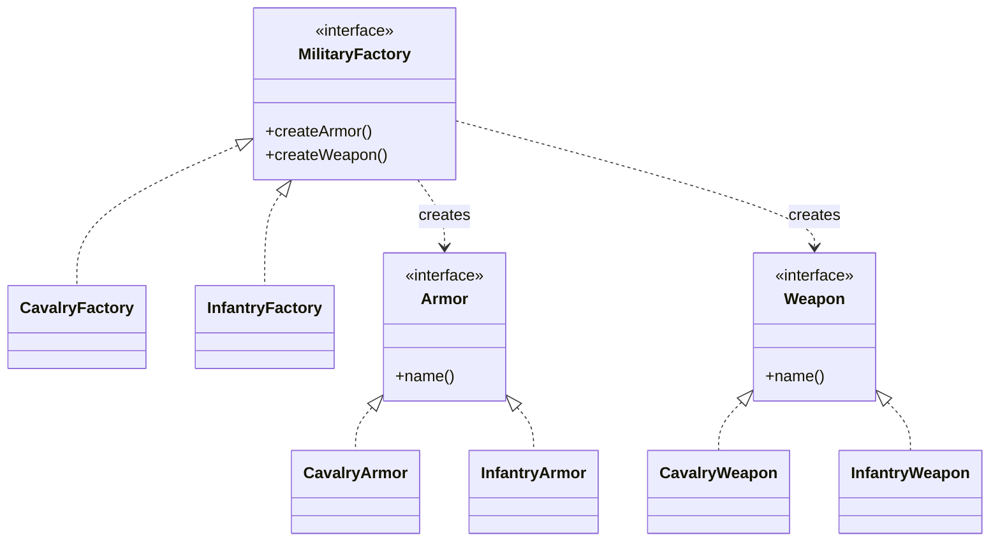

# 第十三回：六曹分署，同出一府：抽象工厂模式


## 开篇引句

真正成制的系统，造出来的从来不是一件东西，而是一整套彼此相认的东西。

## 楔子

沈策入汴梁后，最先服气的不是中书舍人，而是一个老吏。那人管六曹文书三十年，从不出错。别人问他诀窍，他只说：“一府自有一府的成制。兵部的印、兵部的甲册、兵部的号旗，要成套；户部的钱簿、勘合、仓券，也要成套。若把不同衙门的东西混搭，用起来迟早出事。”

后来南征时，沈策照此法整顿行营后勤，把骑兵营、水师营、辎重营所需的一整套装备配置都分开生成，军中杂乱顿少。

他尤其厌恶“临时凑合”的说法。骑兵甲配步兵槊，账面上都叫装备，到了阵前却会互相拖累。成套之物若不能同源，错配迟早会从小缝变成大祸。

## 史局拆解

当系统里不是只创建“一个产品”，而是创建“同一风格的一组产品”时，工厂方法就不够了。你需要确保同一组对象之间彼此匹配，不会乱搭。

问题的重点已经从“谁来 new 对象”变成“哪些对象必须一起出现”。如果业务层分别创建每个对象，它就要承担产品族一致性的责任，这通常不是业务层该背的负担。

## 模式之义

抽象工厂模式提供的是“成套生产能力”。不是只造一件东西，而是按某个产品族，一次提供多种相关对象。

## 如果不这样写，代码通常会长成什么样

很多人会在业务层分别创建铠甲和兵器：

```java
Armor armor = new CavalryArmor();
Weapon weapon = new InfantryWeapon();
```

代码能跑，但同一套体系里的对象会被随意混搭。

## 从问题代码到模式代码，应该怎么想

这里真正要保证的，不只是“能创建对象”，而是“同一组对象彼此匹配”。

所以可以：

1. 先定义一组相关产品接口
2. 再定义能同时产出这组产品的工厂接口
3. 每个具体工厂负责一个完整产品族

抽象工厂把“成套关系”放进工厂本身。调用方选定骑兵工厂，就自然得到骑兵甲和骑枪；它不再有机会把两个体系混在一起。

## Java 示例

```java
interface Armor {
    // 不同铠甲都要能说明自己的身份
    String name();
}

interface Weapon {
    // 不同兵器也要能说明自己的身份
    String name();
}

class CavalryArmor implements Armor {
    @Override
    public String name() {
        // 骑兵体系的铠甲
        return "骑兵甲";
    }
}

class CavalryWeapon implements Weapon {
    @Override
    public String name() {
        // 骑兵体系的兵器
        return "骑枪";
    }
}

class InfantryArmor implements Armor {
    @Override
    public String name() {
        return "步兵甲";
    }
}

class InfantryWeapon implements Weapon {
    @Override
    public String name() {
        return "长槊";
    }
}

interface MilitaryFactory {
    // 一次产出成套对象
    Armor createArmor();
    Weapon createWeapon();
}

class CavalryFactory implements MilitaryFactory {
    @Override
    public Armor createArmor() {
        // 骑兵工厂只生产骑兵甲
        return new CavalryArmor();
    }

    @Override
    public Weapon createWeapon() {
        // 骑兵工厂只生产骑兵兵器
        return new CavalryWeapon();
    }
}

class InfantryFactory implements MilitaryFactory {
    @Override
    public Armor createArmor() {
        // 步兵工厂只生产步兵甲
        return new InfantryArmor();
    }

    @Override
    public Weapon createWeapon() {
        // 步兵工厂只生产步兵兵器
        return new InfantryWeapon();
    }
}

class CampaignService {
    public void prepare(MilitaryFactory factory) {
        // 调用方只选择一套工厂，产品族一致性由工厂保证
        Armor armor = factory.createArmor();
        Weapon weapon = factory.createWeapon();
        System.out.println("发放：" + armor.name() + " 与 " + weapon.name());
    }
}

public class Client {
    public static void main(String[] args) {
        CampaignService service = new CampaignService();

        service.prepare(new CavalryFactory());
        service.prepare(new InfantryFactory());
    }
}
```

## 给其他语言背景的读者

如果你来自 JavaScript，可以把抽象工厂理解成“返回一整组相关对象的工厂函数”。  
Java 里常写成接口套接口，是因为它特别强调产品族边界和类型一致性。  
模式本身关心的是成套创建，不是为了把简单工厂再人为加厚一层。

Python 和 JavaScript 里，抽象工厂经常只是一个返回对象集合的模块或配置函数。Objective-C / Swift 里，若要切换一整套 UI 控件、主题、存储实现，可能会用 protocol 约束一组工厂方法；Swift 也常用泛型和依赖注入容器降低传统工厂层级。

Rust 里抽象工厂通常会变成 trait + 关联类型，或者一组构造函数返回彼此匹配的类型。若产品族在编译期固定，关联类型能保证“骑兵甲配骑枪”这类一致性；若要运行时切换，则可能返回 trait object。Rust 的重点是把“同一产品族”的关系写进类型边界。

## 何时用

- 要创建一整组相关对象
- 同一产品族内部需要保持一致性
- 需要切换整套配置风格

## 何时慎用

产品维度不多时，抽象工厂会显得厚重。若你只造一把刀，却先设六曹分署，制度成本会比收益更高。

## 类图速写

可画成“成套出府图”：

- `MilitaryFactory` 同时生产 `Armor` 与 `Weapon`
- `CavalryFactory`、`InfantryFactory` 各自对应一个产品族



## 下回伏笔

行营成套制备之后，蜀地旧档又堆满了案头。沈策望着一摞摞格式几乎一样的文书，忽然觉得，若还事事从头誊写，人迟早会被重复劳动磨死。

## 收束

抽象工厂模式处理的不是单件制造，而是“成套出府”。一旦你的对象要讲究门类和配套，这一层抽象就很值钱。
