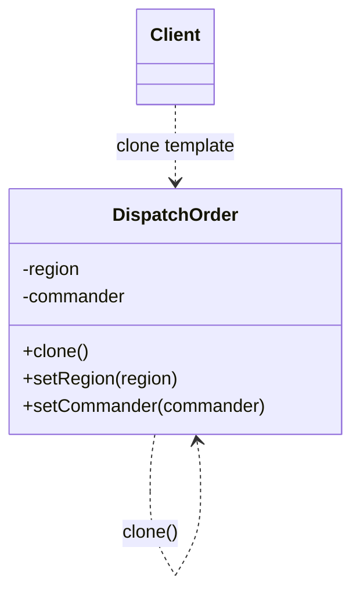

# 第十四回：旧印翻刻，再造新符：原型模式


## 开篇引句

格式若已成型，重复从头来过，往往不是严谨，而是浪费。

## 楔子

蜀地平定后，军府急需发放大量路引、军帖与调兵符。照旧法，每一份都要从头誊录、盖印、校验，几位书吏三天三夜没合眼，还是赶不上前线催要。

沈策看着案上样张，忽然叫人把已经核准的标准文书取来，说：“既然格式大体相同，为何不先有母本，再按母本复制，只改少数关键信息？”

老书吏一拍额头：“早该如此。”

沈策又补了一句：“母本不是偷懒，是把已经校验过的格式留下来。”真正需要变化的，只是州县、姓名、日期这些局部字段；整份文书的骨架不该每次重建。

## 史局拆解

有些对象创建成本高，但许多实例又只是基于某个模板略作修改。如果每次都从零构造，性能和代码复杂度都不划算。

这里的成本不一定只是性能，也可能是初始化步骤复杂、默认字段多、校验链条长。重复构造越多，漏填字段和填错默认值的机会也越多。

## 模式之义

原型模式通过复制已有对象来创建新对象，而不是每次都走完整构造流程。

## 如果不这样写，代码通常会长成什么样

最直接的方式，是每次都从头重新构造对象：

```java
DispatchOrder order1 = new DispatchOrder("河东", "李都督");
DispatchOrder order2 = new DispatchOrder("河东", "李都督");
```

如果大量对象只有少量字段不同，这种写法会很笨重。

## 从问题代码到模式代码，应该怎么想

这里可复用的，不是构造动作本身，而是“已有对象的大部分内容”。

所以可以：

1. 先准备一个母本对象
2. 通过复制拿到新对象
3. 只修改少量差异字段

抽象移走的是“从零搭出完整对象”的责任。新对象继承母本的大部分稳定内容，只在差异处动笔。

## Java 示例

```java
class DispatchOrder implements Cloneable {
    private String region;
    private String commander;

    public DispatchOrder(String region, String commander) {
        this.region = region;
        this.commander = commander;
    }

    public void setRegion(String region) {
        this.region = region;
    }

    public void setCommander(String commander) {
        this.commander = commander;
    }

    @Override
    public DispatchOrder clone() {
        try {
            // 直接基于现有对象复制
            return (DispatchOrder) super.clone();
        } catch (CloneNotSupportedException e) {
            throw new IllegalStateException(e);
        }
    }
}

public class Client {
    public static void main(String[] args) {
        // 母本已经走过完整校验流程
        DispatchOrder template = new DispatchOrder("河东", "李都督");

        DispatchOrder newOrder = template.clone();
        newOrder.setRegion("泽州");
        newOrder.setCommander("王都督");
    }
}
```

## 给其他语言背景的读者

如果你来自 JavaScript，可以把原型模式先理解成“基于现成对象快速拷出新对象，再改差异”。  
Java 里它经常和 `clone()` 绑在一起出现，是因为这套 API 历史上就存在；但工程里也可以手动复制，不必执着于 `Cloneable` 本身。  
模式本体关心的是从样本派生，不是某个老 API 的仪式感。

JavaScript 本身有 prototype 链，但设计模式里的 Prototype 更偏“复制样本对象”，两者不要混在一起。Python 里可以用 `copy` / `deepcopy`，Objective-C 里常见 `NSCopying`，Swift 里值类型天然容易复制，但引用类型仍要小心深浅拷贝。

Rust 里 `Clone` 是显式能力：一个类型能不能复制、复制代价多大，都应当由类型自己声明。很多时候结构体更新语法 `..old` 就能表达“基于旧值改少数字段”。Rust 让原型模式的风险变得更可见，因为所有权和 clone 边界必须写清楚。

## 何时用

- 创建对象代价高
- 大量对象只是局部差异
- 已有实例可作为模板复用

## 何时慎用

对象结构复杂、包含深层引用时，复制语义会变麻烦。印信可翻，账目不可乱抄，深浅拷贝一定要分清。

## 类图速写

可画成“样张翻刻图”：

- `DispatchOrder` 提供 `clone()`
- 新实例基于原实例复制，再修改少量字段



## 下回伏笔

蜀地文书缓过一口气后，朝廷又嫌六部门槛太深。地方使者每来一次都要绕半个京城，沈策便知道，接下来要整顿的，不再是对象复制，而是系统入口。

## 收束

原型模式省下的，不只是创建时间，更是重复造轮子的劳役。先有母本，再批量生发，是乱世文书最现实的办法。
