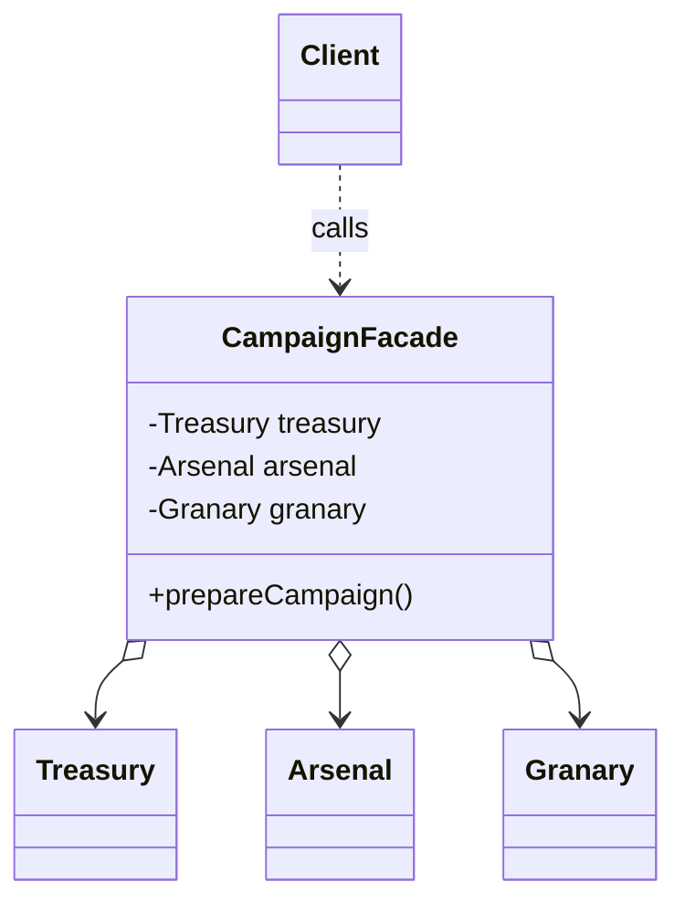

# 第十五回：中书门下，只露一门：外观模式


## 开篇引句

门后可以千头万绪，门前最好只有一条路。

## 楔子

汴梁官署森严，兵部、户部、中书、门下、枢密院彼此分掌权柄。外地使者第一次入朝，常常连门都找不对，不知道一件军粮调拨之事究竟该先见谁、后见谁。

沈策后来在中书门下任职，专门设了一道对外窗口。地方来文先递这里，由内部去协调户部核钱、兵部验额、仓曹出券。外人只看到一扇门，门后却转着半个朝廷。

他没有撤掉任何衙门，也没有把内部流程改得更简单。真正改变的，是外部使者不必再理解这套复杂关系。对外的一门，替他们挡住了门后的枝节。

## 史局拆解

当一个子系统内部很复杂，而调用方只需要一个更简单的入口时，直接暴露全部细节只会增加学习成本和耦合。

直接暴露子系统还有一个后果：外部代码会慢慢复制内部流程。等子系统顺序一改，散落在各处的调用脚本都要跟着重排。

## 模式之义

外观模式就是给复杂子系统提供一个统一的高层接口。对外只见一门，对内仍可各司其职。

## 如果不这样写，代码通常会长成什么样

调用方会自己去挨个调用所有子系统：

```java
Treasury treasury = new Treasury();
Arsenal arsenal = new Arsenal();
Granary granary = new Granary();

treasury.allocateFunds();
arsenal.supplyWeapons();
granary.releaseFood();
```

这样会让外部调用者知道太多内部细节。

## 从问题代码到模式代码，应该怎么想

这里真正需要简化的，不是子系统内部，而是对外入口。

所以可以：

1. 保留原有子系统不动
2. 在外面加一个统一入口
3. 让调用方只面对这一层入口

外观层并不消灭复杂性，而是把复杂性圈在系统边界之内。调用方得到稳定入口，内部模块仍然可以各自演进。

## Java 示例

```java
class Treasury {
    public void allocateFunds() {
        // 户部拨款
        System.out.println("户部拨款");
    }
}

class Arsenal {
    public void supplyWeapons() {
        // 兵部发械
        System.out.println("兵部发械");
    }
}

class Granary {
    public void releaseFood() {
        // 仓曹开粮
        System.out.println("仓曹开粮");
    }
}

class CampaignFacade {
    // 外观对象内部聚合多个复杂子系统
    private final Treasury treasury = new Treasury();
    private final Arsenal arsenal = new Arsenal();
    private final Granary granary = new Granary();

    public void prepareCampaign() {
        // 对外只暴露一个高层入口
        treasury.allocateFunds();
        arsenal.supplyWeapons();
        granary.releaseFood();
    }
}

public class Client {
    public static void main(String[] args) {
        // 调用方只面对外观入口，不需要理解门后的衙署顺序
        CampaignFacade facade = new CampaignFacade();
        facade.prepareCampaign();
    }
}
```

## 给其他语言背景的读者

如果你来自 JavaScript，可以把外观模式先理解成“把一堆底层 API 包成一个更顺手的高层函数”。  
Java 里常用一个 Facade 类承接这层职责，因为它很适合做明确的系统边界。  
模式本身关心的是降低调用复杂度，不是把所有子系统硬塞成一个万能对象。

Python 和 JavaScript 里，一个模块导出的少量函数就可能是外观。Objective-C / Swift 里，SDK 经常用 manager、service 或 facade object 把底层 delegate、队列、权限、缓存包起来。Swift 也常通过 protocol 定义一个窄接口，把复杂实现藏在模块内部。

Rust 里外观常是 crate 的公开 API 设计：内部模块很多，对外只暴露少量函数、类型和 trait。`pub(crate)`、模块边界和 re-export 能自然形成外观。它提醒你：外观不只是一个类，也可以是整个包对外呈现的门面。

## 何时用

- 子系统复杂
- 调用方只需要简化入口
- 想降低系统间耦合

## 何时慎用

外观不能替代子系统设计本身。若门后本就一团糟，前面挂块好匾也只是遮羞。

## 类图速写

可画成“对外一门图”：

- `CampaignFacade` 聚合 `Treasury`、`Arsenal`、`Granary`
- 调用方只面对统一入口



## 下回伏笔

入口整顿之后，新的麻烦又冒出来了。南下运军资时，沈策发现运输方式和运输内容彼此纠缠，像两股绳拧成死结，怎么拆都别扭。

## 收束

外观模式的价值，在于让外部世界少看见一点混乱，多看见一点秩序。
