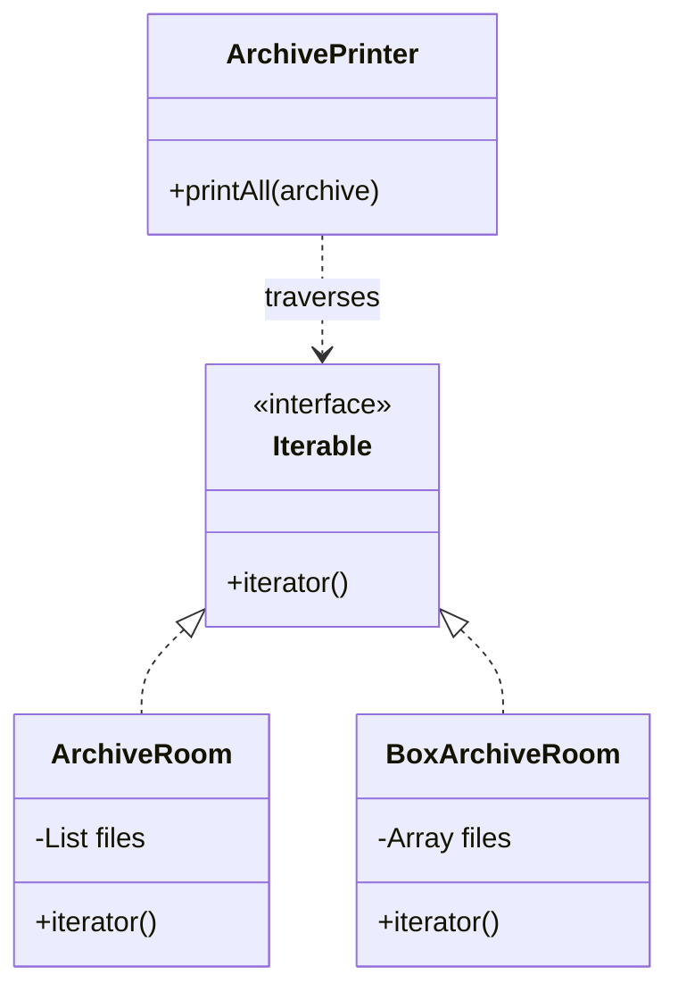

# 第十九回：案卷千箱，次第检看：迭代器模式


## 开篇引句

会存是一种本事，会看是另一种本事，不该逼所有人两样都精通。

## 楔子

平蜀之后，大量旧档入库。军府后廊堆满了箱笼，按年月、州县、军种、案别分类，连搬运都得先列清单。新来的书吏每次要查一类案卷，都得先学一遍库房内部怎么排。

沈策觉得这不对。他说：“查卷人只该关心如何一份份往下看，不该先懂你箱子怎么码、柜子怎么排。”

于是库房仍可按年月重排，也可按州县另设索引；查卷人拿到的却始终是一条“下一份”的路。库房怎么变，是库房内部的事。

## 史局拆解

集合内部结构可能变化，但遍历需求长期存在。如果外部代码依赖集合内部细节，一旦存储结构调整，遍历逻辑就要跟着改。

直接暴露内部结构，还会让调用方顺手做越界访问、跳着取、改着取。等集合想控制遍历顺序或加入过滤规则时，就会发现外部已经绕过了入口。

## 模式之义

迭代器模式提供一种统一的遍历方式，让调用方不暴露集合内部结构，也能按顺序访问元素。

## 如果不这样写，代码通常会长成什么样

调用方会直接依赖集合内部存储细节：

```java
for (int i = 0; i < files.size(); i++) {
    System.out.println(files.get(i));
}
```

如果未来底层存储不再是 `List`，遍历代码就得跟着改。

## 从问题代码到模式代码，应该怎么想

这里要隔离的，不是元素本身，而是“访问集合内部结构”的方式。

所以可以：

1. 让集合自己提供遍历入口
2. 调用方只关心按顺序访问，不关心内部怎么存

抽象之后，集合保留存储细节，迭代器提供访问节奏。调用方看见的是“还有没有下一份”，不是箱笼、架位和索引表。

## Java 示例

```java
import java.util.ArrayList;
import java.util.Iterator;
import java.util.List;

class ArchiveRoom implements Iterable<String> {
    private final List<String> files = new ArrayList<>();

    public void add(String file) {
        files.add(file);
    }

    @Override
    public Iterator<String> iterator() {
        // 对外暴露统一的遍历入口，而不暴露内部结构
        return files.iterator();
    }
}

class BoxArchiveRoom implements Iterable<String> {
    private final String[] files;

    public BoxArchiveRoom(String[] files) {
        this.files = files;
    }

    @Override
    public Iterator<String> iterator() {
        // 底层是数组，也可以提供同样的遍历入口
        return java.util.Arrays.asList(files).iterator();
    }
}

class ArchivePrinter {
    public void printAll(Iterable<String> archive) {
        // 调用方只依赖 Iterable，不关心底层是 List 还是数组
        for (String file : archive) {
            System.out.println(file);
        }
    }
}

public class Client {
    public static void main(String[] args) {
        ArchiveRoom listArchive = new ArchiveRoom();
        listArchive.add("河东军报");

        BoxArchiveRoom arrayArchive = new BoxArchiveRoom(new String[] {"蜀地旧档"});

        ArchivePrinter printer = new ArchivePrinter();
        printer.printAll(listArchive);
        printer.printAll(arrayArchive);
    }
}
```

## 给其他语言背景的读者

如果你来自 JavaScript，可以把迭代器模式先理解成“约定一种统一遍历协议”。  
Java 里很多场景已经由集合框架内置了迭代器，所以你常常是在“使用这种思想”，而不是亲手实现一整套类。  
模式本身关心的是遍历与存储解耦，不是为了多造几个接口。

Python 里 `__iter__` / `__next__` 和生成器已经把迭代器变成日常语法；JavaScript 里也有 iterable protocol 和 generator。Objective-C 有 fast enumeration，Swift 有 `Sequence` / `IteratorProtocol`，所以多数时候你是在实现语言协议，而不是照书造类。

Rust 的迭代器尤其强：`Iterator` trait、适配器链、惰性求值和所有权规则结合得很紧。很多遍历、过滤、映射都能写成 iterator pipeline。这里的模式几乎已经变成语言核心习惯，重点是理解迭代会借用、移动还是生成新值。

## 何时用

- 需要统一遍历不同集合
- 不想暴露集合内部结构
- 遍历逻辑和集合本身应分离

## 何时慎用

在 Java 里，大量场景已经由集合框架提供了成熟迭代器，不必为了模式而再造一层。

## 类图速写

可画成“依序取卷图”：

- `ArchiveRoom` 作为聚合对象
- 通过 `iterator()` 提供统一遍历入口



## 下回伏笔

旧档整理完，朝议却更乱了。兵部、户部、工部、枢密院互相递话，人人都能找人人，结果人人都在拖人人。沈策知道，再不立一个居中者，中枢早晚要被吵散。

## 收束

迭代器模式做的，是把“怎么存”与“怎么看”分开。查卷的人只看卷，不必先学会盖库房。
