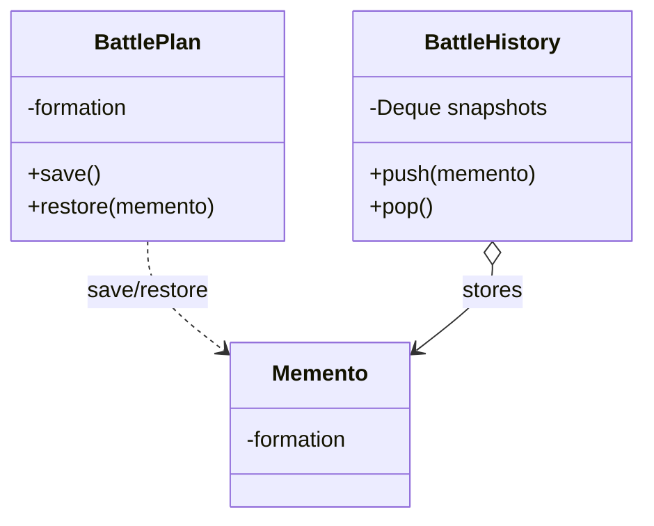

# 第二十一回：败局可记，不可重蹈：备忘录模式


## 开篇引句

吃过的亏若不能被妥善记住，历史很快就会再收一次学费。

## 楔子

南征失利那年，前军误判水势，渡口折了数百人。事后人人都说要吸取教训，可真正能留下来的，常常只剩几句空话。沈策不肯如此。他命幕僚把战前兵力、天气、水文、命令流转、败因分析全部存档，并要求以后每逢相似战事，都先调出旧卷重看。

“记错了，人会死第二次。”他说。

但沈策也不许幕僚随便翻改旧卷。旧卷可以被调出、被比照，却不能让外人直接改动战前布置的内部记录。能回到过去，不等于能随意拆开过去。

## 史局拆解

对象有时需要保存某一时刻的内部状态，以便之后恢复或回滚。但若让外部直接暴露和修改这些内部细节，又会破坏封装。

直接把字段交给外部保存，看似简单，却会让外部代码逐渐理解并依赖对象内部结构。内部字段一改，所有快照逻辑都可能失效。

## 模式之义

备忘录模式把对象某一时刻的状态封装起来保存，未来需要时再恢复，而不让外部窥探太多内部实现。

## 如果不这样写，代码通常会长成什么样

很多人会直接把内部字段暴露给外部，再由外部自己保存：

```java
String oldFormation = battlePlan.getFormation();
```

这样封装会越来越松，外部知道得也越来越多。

## 从问题代码到模式代码，应该怎么想

这里要保存的是“某一时刻的内部状态”，但又不想把内部细节全部公开。

所以可以：

1. 让对象自己负责生成快照
2. 让对象自己负责从快照恢复
3. 外部只保存快照，不直接碰内部字段

抽象之后，发起者自己知道如何保存和恢复；管理者只负责保管快照。这样既能回滚，又不必把内部细节摊开给外界。

## Java 示例

```java
class BattlePlan {
    private String formation;

    public void setFormation(String formation) {
        this.formation = formation;
    }

    public Memento save() {
        // 当前对象自己生成一个状态快照
        return new Memento(formation);
    }

    public void restore(Memento memento) {
        // 需要回滚时，再从快照恢复
        this.formation = memento.formation;
    }

    static class Memento {
        // 快照对象只负责封存状态
        private final String formation;

        private Memento(String formation) {
            this.formation = formation;
        }
    }
}

class BattleHistory {
    private final java.util.Deque<BattlePlan.Memento> snapshots = new java.util.ArrayDeque<>();

    public void push(BattlePlan.Memento memento) {
        // 管理者只保存快照，不知道内部字段是什么
        snapshots.push(memento);
    }

    public BattlePlan.Memento pop() {
        return snapshots.pop();
    }
}

public class Client {
    public static void main(String[] args) {
        BattlePlan plan = new BattlePlan();
        BattleHistory history = new BattleHistory();

        plan.setFormation("雁行阵");
        history.push(plan.save());

        plan.setFormation("鱼鳞阵");
        plan.restore(history.pop());
    }
}
```

## 给其他语言背景的读者

如果你来自 JavaScript，可以把备忘录模式先理解成“生成一个受控快照，用来回滚”。  
Java 里常把快照写成内部类，是为了更明确地控制谁能看到这份状态。  
模式本身关心的是快照与恢复，不是为了把普通拷贝写得故作神秘。

Python 和 JavaScript 里，如果状态是普通对象，浅拷贝和深拷贝都很容易写，但也更容易不小心共享内部引用。Objective-C 里可借助 `NSCopying`，Swift 值类型天然适合做快照；若状态是引用类型，仍要小心到底复制了哪一层。

Rust 里备忘录常依赖 `Clone`、不可变数据结构或事件溯源。所有权模型会让快照成本变得明确：克隆大状态很贵，共享状态要考虑 `Rc` / `Arc`，可变状态要考虑锁。Rust 不会阻止你做快照，但会让“保存过去”这件事付出的代价很难被忽略。

## 何时用

- 需要回滚或撤销
- 需要保存历史快照
- 又不想破坏对象封装

## 何时慎用

状态过大、快照过多时，存储成本会很高。旧卷该留，但不能把整个天下每一时每一刻都刻进石头里。

## 类图速写

可画成“战局封匣图”：

- `BattlePlan` 负责创建与恢复 `Memento`
- `Memento` 封存某一时刻的内部状态



## 下回伏笔

旧败案存好后，朝廷开始派巡按四出。沈策随行数次，渐渐发现，真正经常变化的，不是州县本身，而是巡视者这次打算从什么角度看它。

## 收束

备忘录模式留住的是“当时的局面”。它让系统在必要时能回头，而不是永远硬着头皮往前撞。
