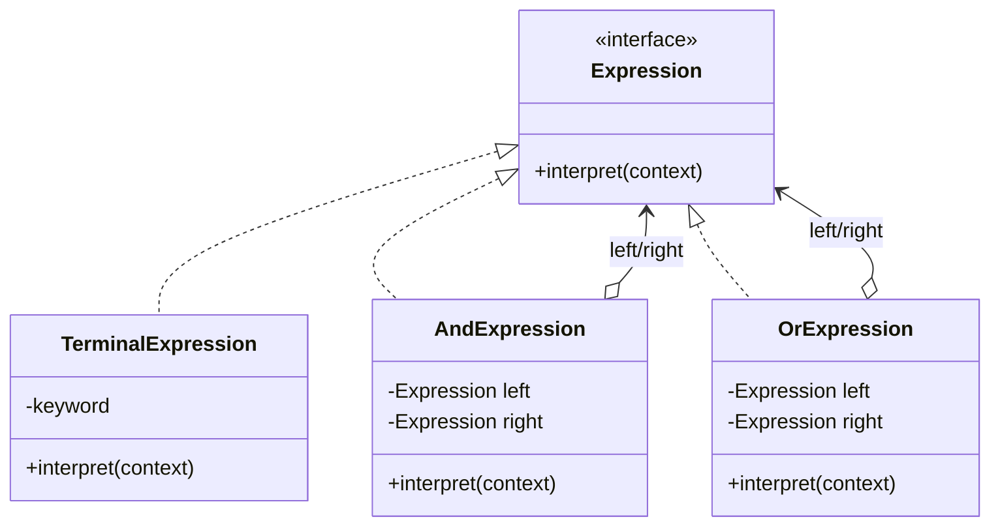

# 第二十三回：天下纷乱，终须立说：解释器模式


## 开篇引句

乱世走到尽头，留下来的不只是旧事，还有解释旧事的话语。

## 楔子

沈策晚年退居江南，替一位藩主整理旧日军政条目。藩主嫌法令繁琐，想要一套更易读的简令：何种边报属于“急”、何种调兵属于“可先行后奏”、何种税项属于“战时豁免”。这些规则若全写成散乱代码，后人只会越改越乱。

沈策沉思数日，最后把规则写成一种小型语法：什么词代表兵、什么词代表粮、什么词代表紧急，如何组合，如何判断。众人看不懂他为何如此费事，他却说：“天下事太杂，到了最后，总得立一套说法，让规则自己能被读、被拆、被解释。”

他并不想把天下写成一部大法典，而是把最常用、最稳定的判断语句拆成词和句。词能复用，句能组合，后来者改规则时，至少知道自己是在改哪一层。

## 史局拆解

有些业务规则本身就像一门小语言。若规则频繁变化，又存在明确语法结构，直接把逻辑硬写死在代码里会越来越难维护。

硬编码的问题，是规则既不能被读，也不能被组合。今天加一个“且”，明天加一个“或”，后天再加括号优先级，散落的条件判断很快就会变成隐形语法。

## 模式之义

解释器模式为语言定义文法，并提供解释执行的方法。它适合处理简单、结构明确、可组合的规则表达式。

## 如果不这样写，代码通常会长成什么样

很多项目一开始会把规则直接写死在条件判断里：

```java
if (context.contains("兵") && context.contains("急")) {
    return true;
}
```

规则一多，这些判断会越来越散，也越来越难组合。

## 从问题代码到模式代码，应该怎么想

这里真正要独立出来的，不是某一条判断，而是“规则本身像一门小语言”。

所以可以：

1. 先把最基础的词定义成终结表达式
2. 再把组合规则定义成复合表达式
3. 最后由这些表达式共同解释上下文

抽象移走的是“在业务代码里临时拼规则”的责任。规则被拆成表达式树后，每个节点只解释自己那一小段文法。

## Java 示例

```java
interface Expression {
    // 所有规则表达式都要能解释上下文
    boolean interpret(String context);
}

class TerminalExpression implements Expression {
    private final String keyword;

    public TerminalExpression(String keyword) {
        this.keyword = keyword;
    }

    @Override
    public boolean interpret(String context) {
        // 最基础的规则：是否包含某个关键词
        return context.contains(keyword);
    }
}

class AndExpression implements Expression {
    private final Expression left;
    private final Expression right;

    public AndExpression(Expression left, Expression right) {
        this.left = left;
        this.right = right;
    }

    @Override
    public boolean interpret(String context) {
        // 组合规则：左右表达式都成立才成立
        return left.interpret(context) && right.interpret(context);
    }
}

class OrExpression implements Expression {
    private final Expression left;
    private final Expression right;

    public OrExpression(Expression left, Expression right) {
        this.left = left;
        this.right = right;
    }

    @Override
    public boolean interpret(String context) {
        // 组合规则：左右表达式任一成立即可
        return left.interpret(context) || right.interpret(context);
    }
}

public class Client {
    public static void main(String[] args) {
        Expression urgentMilitary = new AndExpression(
            new TerminalExpression("兵"),
            new TerminalExpression("急")
        );
        Expression wartimeRelief = new OrExpression(
            urgentMilitary,
            new TerminalExpression("战时豁免")
        );

        System.out.println(wartimeRelief.interpret("兵部急报"));
    }
}
```

## 给其他语言背景的读者

如果你来自 JavaScript，可以把解释器模式先理解成“把一套规则拆成可组合的小表达式”，有点像自己搭一个很轻的小 DSL。  
Java 里它常写成很多表达式类，是因为类很适合承载文法节点。  
模式本身关心的是规则可组合、可解释，不是要求你凡写规则都先发明一门语言。

Python 和 JavaScript 很适合做小型 DSL，因为函数、字典、闭包和动态对象都轻；Objective-C / Swift 里则可能用 parser、result builder、枚举表达式树或规则对象来承载语法。Swift 的 result builder 在声明式 DSL 上尤其常见，但它更适合结构化构建，不等同于完整解释器。

Rust 里解释器常会先把规则解析成 enum AST，再用 `match` 解释执行；需要性能或语法复杂时，会引入 parser combinator、`nom`、`pest` 等工具。Rust 的强类型适合把文法节点刻清楚，但也提醒你：规则一复杂，就该考虑专门解析器，而不是手写一堆临时判断。

## 何时用

- 规则可表达为简单语法
- 规则频繁变化
- 需要把规则组合、解析、执行

## 何时慎用

语法一复杂，解释器模式会迅速变重。真正大型语言通常更适合专门的解析器工具，而不是自己手写一整座法典。

## 类图速写

可画成“规则成句图”：

- `Expression` 是统一文法抽象
- `TerminalExpression` 表示终结符
- `AndExpression` 等组合表达式负责拼装规则



## 下回余响

这一回之后，沈策的故事其实可以停下，但这套结构不会停。每逢新的系统混乱出现，后来人仍会沿着他留下的这些章法，重新给天下立规矩。

## 收束

解释器模式是这套故事的收尾，因为乱世到了最后，总会留下两样东西：一堆旧案，和一套解释旧案的方法。
